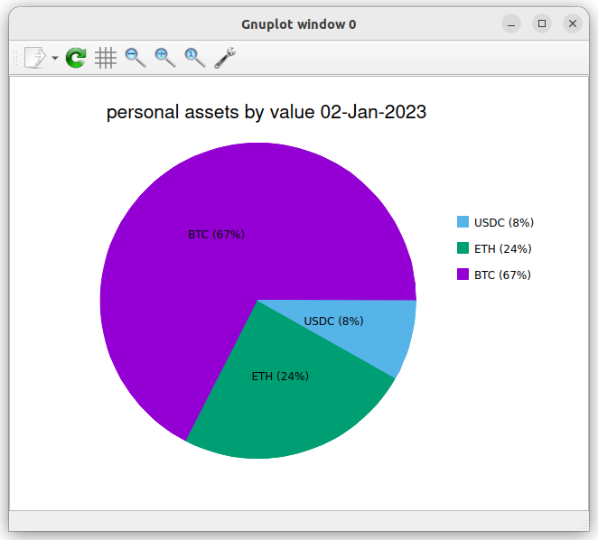
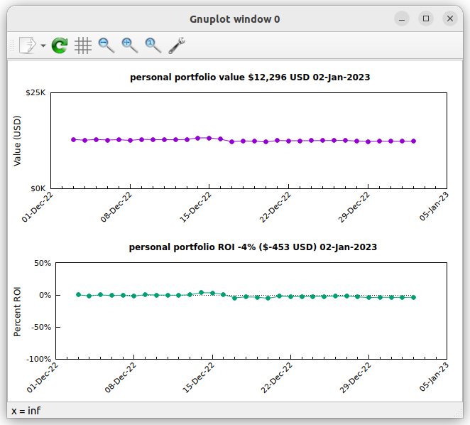

# Cryptor

Cryptor valuates cryptocurrency asset portfolios.

-   Processes multiple asset portfolios.
-   Reports the current value and performance of cryptocurrency assets.

## Quick Start

If you have [Go](https://go.dev/) installed on your
system then you can download and compile the latest version with this command:

    go install github.com/srackham/cryptor@latest

Pre-compiled binaries are also available on the
[Cryptor releases page](https://github.com/srackham/cryptor/releases).
Download the relevant release and extract the `cryptor` executable.

Install an example configuration using the `cryptor init` command. For example:

```
$ cryptor init
creating configuration directory: "/home/srackham/.config/cryptor"
installing example config file: "/home/srackham/.config/cryptor/config.yaml"
installing example portfolios file: "/home/srackham/.config/cryptor/portfolios.yaml"
creating cache directory: "/home/srackham/.cache/cryptor"
creating data directory: "/home/srackham/.local/share/cryptor"
```

Edit the YAML portfolios configuration file (`$HOME/.config/cryptor/portfolios.yaml`) to match your portfolios.

Use the `cryptor valuate` command to value the portfolios. For example:

```
$ cryptor valuate

NAME:  personal
NOTES:
DATE:  2025-02-10
TIME:  19:08:45
VALUE: 55202.96 USD
COST:  10000.00 USD
GAINS: 45202.96 USD (452.03%)
XRATE:
            AMOUNT            VALUE    PERCENT       UNIT PRICE
BTC         0.5000     48522.29 USD     87.90%     97044.58 USD
ETH         2.5000      6580.68 USD     11.92%      2632.27 USD
USDC      100.0000        99.99 USD      0.18%         1.00 USD
```

Run the `cryptor help` command to view all the commands and command options:

```
$ cryptor help

Usage:
    cryptor COMMAND [OPTION]...

Description:
    Cryptor valuates crypto currency asset portfolios.

Commands:
    init     create configuration directory and install default config and
             example portfolios files
    valuate  valuate, print and save portfolio valuations
    history  Print saved portfolio valuations
    help     display documentation

Options:
    -aggregate                  Include aggregated portfolios in printed valuation
    -aggregate-only             Only include aggregated portfolios in printed valuation
    -confdir CONF_DIR           Directory containing config, data and cache files
    -currency CURRENCY          Print fiat currency values denominated in CURRENCY
    -notes                      Include portfolio notes in the valuations
    -save                       Update the valuations file
    -portfolio PORTFOLIO        Process named portfolio (default: all portfolios)
    -price SYMBOL=PRICE         Override the asset price of SYMBOL with PRICE (in USD)
    -format FORMAT              Set the valuate command output format ("json" or "yaml")

Config directory: /home/srackham/.config/cryptor
Cache directory:  /home/srackham/.cache/cryptor
Data directory:   /home/srackham/.local/share/cryptor

Version:    v0.3.0 (-)
Git commit: -
Built:      -
Github:     https://github.com/srackham/cryptor
```

## Implementation and Usage Notes

-   The `valuate` command values portfolio assets specified in the `portfolios.yaml` configuration file.
-   All values are saved in USD (the `-currency` option can be used to display printed values in non-USD currencies).
-   Fiat currency exchange rates are cached locally and refreshed daily.
-   Portfolio names are unique and can only contain alphanumeric characters, underscores and dashes.
-   If you specify a portfolio's `COST` amount (the total amount paid for the portfolio assets) then portfolio gains (or losses) are calculated.
-   The portfolio `COST` value is formatted like `<amount><symbol>`. The amount is mandatory; the currency symbol is optional and defaults to `USD`; dollar, comma and space characters are ignored; case insensitive. Examples:

          $5,000.00 NZD     # Five thousand New Zealand dollars.
          1000aud           # One thousand Australian dollars.
          .5                # Fifty cents USD.

-   Asset and currency symbols are case insensitive and are converted to uppercase.
-   Saved portfolio valuations include the valuation's local `date` and `time`.
-   Dates are saved as `YYYY-DD-MM` formatted strings.
-   Times are saved as `hh:mm:ss` formatted strings.
-   The `-portfolio` option can be specified multiple times.
-   The `-price` option allows the user to override current asset prices in order to evaluate "what if" scenarios. Example:

        cryptor valuate -price btc=50000    # Price Bitcoin at $50,000 USD

-   The `-price` option can be specified multiple times.
-   The `-price` option could be used to include non-crypto assets, e.g. gold, in the portfolios.
-   Cryptocurrency prices are fetched using the [Binance HTTP ticker price](https://github.com/binance/binance-spot-api-docs/blob/master/rest-api.md#symbol-price-ticker) API.
-   Fiat currency exchange rates are fetched using the [Open Exchange Rates](https://openexchangerates.org/) API.
-   By default valuations are printed in a human-friendly text format; use the `-format` option to print in JSON or YAML formats.
-   Currency values in JSON and YAML formats are always in USD.

## Files

Cryptor processes the following configuration, cache, and data files:

-   `$HOME/.config/cryptor/config.yaml`: YAML formatted cryptor options
-   `$HOME/.config/cryptor/portfolios.yaml`: YAML formatted portfolios
-   `$HOME/.cache/cryptor/exchange-rates.json`: JSON formatted cached fiat currency exchange rates
-   `$HOME/.local/share/data/cryptor/valuations.json`: JSON formatted valuations

The default locations conform to the [XDG Base Directory Specification](https://specifications.freedesktop.org/basedir-spec/latest/);
an alternate single directory for all files can be specified using the `-confdir` command option.

## Valuations

-   The `valuate` command prints and saves valuations in the same order that they occur in the portfolios configuration file.
-   The printed output can be customised using the `-portfolio`, `-aggregate` and `-aggregate-only` options.
-   If the `-save` option is specified the valuation of all portfolios is appended to the `valuations.json` valuations file; the aggregate valuation is appended after the portfolio valuations.
-   Saved valuations always include all portfolio valuations plus the aggregate valuation.
-   The `aggregate` portfolio is the aggregate of all portfolios, not just those specified by `-portfolio` options.
-   The `valuations.json` file is located in the data configuration directory.
-   The `-portfolio`, `-aggregate` and `-aggregate-only` options apply to printed outputs.

## Post-processing Valuation Data

The [jq](https://github.com/jqlang/jq) command is useful for munging and extracting valuation data:

-   The following command pipes JSON output from the `valuate` command through a `jq` filter transforms it into CSV asset records:

          cryptor valuate -format json | jq -r '.[] | . as $p | .assets[] | [$p.name, $p.date,$p.time,.symbol,.amount,.value,.allocation] | @csv'

-   This command lists all saved portfolio valuations, includes a CSV header, and rounds numbers to two decimal places:

          cryptor history | jq -r '["NAME","DATE","TIME","VALUE","ROI"], (.[] | select(.cost>0) | [.name, .date, .time, (.value*100 | floor | ./100), ((.value-.cost)/.cost*100*100 | floor | ./100)]) | @csv'

-   The next command pipes the saved `personal` portfolio valuations through a `jq` filter to generate per-day CSV ROI (return on investment) records by selecting the first portfolio record of the day:

          cryptor history -portfolio personal | jq -r 'group_by(.date) | map(. | map(select(.cost > 0)) | sort_by(.time) | first) | .[] | select(.) | [.name, .date, .value, (.value-.cost)/.cost*100] | @csv'

## Plotting Portfolio Valuation Data

The cryptor repository includes an `examples` folder which contains bash scripts for plotting portfolio valuations. The scripts read the `cryptor` output on `stdin` and use [jq](https://stedolan.github.io/jq/) (to generate CSV plot data) and [gnuplot](http://www.gnuplot.info/) (to plot the CSV data).

### Portfolio valuation pie chart
The bash script `examples/plot-valuation.sh` plots a `cryptor` valuation. For example:

    cryptor valuate -portfolio personal -format json | examples/plot-valuation.sh



### Portfolio history chart
The bash script `examples/plot-history.sh` plots `cryptor` history data. For example:

    cryptor history -portfolio personal | examples/plot-history.sh


